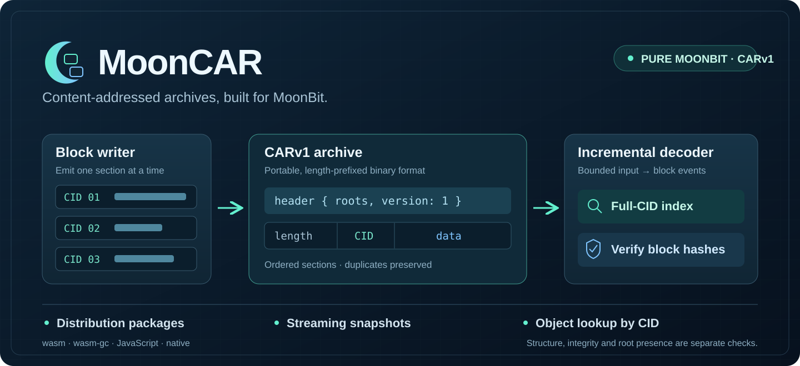

# MoonCAR



*Write blocks → exchange a CARv1 archive → consume, index and verify blocks.*

Pure MoonBit **CARv1 archive** reading, writing, streaming, integrity verification
and exact CID offset indexing. Reusable data-exchange infrastructure for the
MoonBit ecosystem. Apache-2.0 licensed.

The archive layer is implemented here. [MoonLoom](https://github.com/ggbond44439/moonloom)
provides CID, multihash, varints and hash providers;
[2515050242/cbor](https://github.com/2515050242/moonbit-cbor-RFC-8949-CBOR-Concise-Binary-Object-Representation)
provides CBOR. See the [ecosystem audit](docs/ecosystem-audit.md).

## Run from source

Install the [MoonBit stable toolchain](https://www.moonbitlang.com/download/).
Tested with `moonc v0.10.14+7d59c7ec9`, `moon 0.1.20260920`.

```text
git clone https://github.com/CaptainK-65/moon-car.git
cd moon-car
moon update
moon check --target all --deny-warn
moon test --target all
moon build --target all
moon run examples/pack
moon run examples/stream
moon run examples/lookup
moon run cmd/mooncar --target native -- verify fixtures/carv1-basic.car
```

The pure library and examples support wasm, wasm-gc, JS and native. The file CLI
uses `moonbitlang/async` and runs on native; a C compiler is required.

## Use as a library

Add `"CaptainK-65/moon-car@0.1.0"` and `"ggbond44439/moonloom@0.1.6"` to module
imports, then import their root packages as `@car` and `@cid` in your `moon.pkg`.

```moonbit
let cid = @cid.cid_from_content(
  @cid.RAW_CODEC, @cid.Sha2_256, b"hello",
  @cid.sha2_provider(), @cid.Limits::default(),
).unwrap()
let bytes = @car.encode(@car.Header::new([cid]), [@car.Block::new(cid, b"hello")])
let archive = @car.Archive::decode(bytes)
archive.verify(require_roots=true)
let payload = archive.get(cid).data()
```

Call these operations in a function that allows `raise CarError`. See exact
signatures in the [generated public interface](pkg.generated.mbti).

## Three complete use cases

| Use case | Processing | Runnable example |
| --- | --- | --- |
| Distribution | Hash objects, write archive, read and verify it | `moon run examples/pack` |
| Transport snapshot | Feed seven-byte chunks, consume and verify events, finish at EOF | `moon run examples/stream` |
| Object lookup | Scan once, index full CID bytes, locate and verify a payload | `moon run examples/lookup` |

`Writer::start` emits the header; `write` emits one section and its absolute offsets.
The caller supplies the sink. `Decoder::feed` emits completed header/block events;
**always call `finish` at EOF**. Parse errors poison the decoder. Events from a
failing feed call are discarded. Provide bounded chunks and release consumed events.

## File CLI

```text
moon run cmd/mooncar --target native -- pack bundle.car README.md
moon run cmd/mooncar --target native -- inspect bundle.car
moon run cmd/mooncar --target native -- verify bundle.car
moon run cmd/mooncar --target native -- get bundle.car CID extracted.bin
moon run cmd/mooncar --target native -- rewrite bundle.car rewritten.car
```

`pack` creates raw blocks and makes every input a root. It does not preserve filenames
or create UnixFS metadata. `inspect` checks structure; `verify` checks every occurrence
and root presence; `get` verifies the selected payload. `rewrite` verifies first,
preserves source order and duplicates, and requires a new output path. `pack` and
`get` replace their output file.

## Policies and budgets

- Canonical DAG-CBOR header: exactly `roots` and `version`, ordered keys, definite
  lengths, minimal integers, tag 42 with identity-prefixed CID.
- CARv1 only; CIDv0 and CIDv1; canonical unsigned-varint section framing.
- Empty root arrays, header-only archives, empty payloads and duplicates are allowed.
- Defaults: 1 MiB header, 16 MiB block section including CID, 1024 roots,
  1,000,000 sections, 256 MiB archive, 1024-byte CID digests.
- Declared budgets are checked before payload allocation. `Limits::new` accepts
  custom positive budgets; root/block counts may be zero. Offsets use MoonBit `Int`.
- Parsing, hash integrity and root presence are separate checks. None proves
  transitive DAG closure. Unsupported hash algorithms fail verification.
- Same ordered inputs yield the same output; universal canonical graph ordering
  is not claimed.

Decoder retains one section plus prefix capacity; returned events also own payloads.
Feeding an entire archive in one call may retain that call's payloads. Archive retains
the original bytes plus CID/offset metadata and materializes requested blocks.
The convenience encoder and CLI use bounded whole-archive memory.

## Evidence and scope

Independent [IPLD fixture](fixtures/README.md), exact offsets, byte-for-byte rewrite,
all split positions, malformed headers, overflow, budget boundaries, duplicate
corruption and binary payload/chunk matrices. See [acceptance](docs/acceptance.md)
and [design](docs/design.md).

Published package: [CaptainK-65/moon-car@0.1.0](https://mooncakes.io/docs/CaptainK-65/moon-car@0.1.0).
Verify it independently with `moon run tools/verify_published.mbtx --target native`.
Initial reproducible timings: [performance record](docs/performance.md).

Version 0.1 excludes CARv2, persistent storage/indexes, UnixFS and DAG closure traversal.
The October competition proposal must be written by the participant.

## Contributing

See [CONTRIBUTING.md](CONTRIBUTING.md) for reproduction requirements, local checks
and source provenance. Track bugs and concrete improvements through
[Issues](https://github.com/CaptainK-65/moon-car/issues); completed records link to
their implementing commits and Actions evidence.
